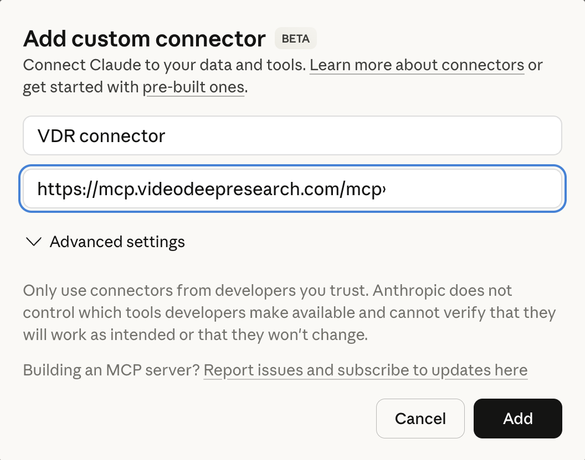
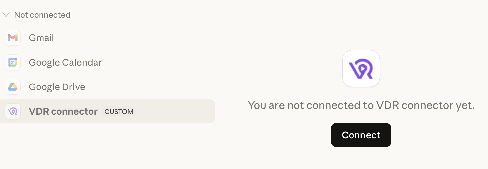

# VDR Plugins - Video Deep Research

Plugin marketplace for [Video Deep Research](https://videodeepresearch.com) MCP servers. Search and analyze millions of videos and ads using AI-powered deep research.

## Claude Desktop / Cowork (OAuth — recommended)

1. Open the **Claude Desktop application**.
2. Click **Customize** from left panel.
3. Click **Connectors**.
4. Click **+** and select **Add custom connector**.
5. Input a connector name and enter the server URL: `https://mcp.videodeepresearch.com/mcp`



6. Click **VDR Connector** and click **Connect** button.



7. Complete the OAuth sign-in flow when prompted. (Make sure you have logged into your Claude.ai account.)
8. The VDR Connector will appear connected.

The setup on [claude.ai](https://claude.ai) is similar — go to **Settings → Connectors → Add custom connector** and enter the same server URL.

No API keys or environment variables needed — Claude handles OAuth automatically.

## Claude Code CLI (API key)

### 1. Add the marketplace

```
claude plugin marketplace add deepvideolab-ai/vdr-marketplace
```

### 2. Install the plugin

```
claude plugin install vdr-video-research@vdr-plugin
```

### 3. Set your API token

**Option A:** Add to your shell profile (`~/.bashrc` or `~/.zshrc`):

```bash
export VDR_MCP_TOKEN='your-api-token-here'
```

**Option B:** Edit the installed plugin config at `~/.claude/plugins/vdr-video-research/.mcp.json` and replace `your-api-token-here` with your actual API token:

```json
{
  "mcpServers": {
    "vdr-video-research": {
      "type": "http",
      "url": "https://mcp.videodeepresearch.com/mcp",
      "headers": {
        "Authorization": "Bearer your-api-token-here"
      }
    }
  }
}
```

### 4. Use it

Ask Claude Code to search videos:

```
Search for videos about electric vehicle marketing strategies
```

Or use the skills directly:

```
/vdr-video-research:talk-to-1M Find videos about AI coding assistants
/vdr-video-research:talk-to-ads What creative strategies are beauty brands using?
```

## MCP Server (Direct Setup)

If you want to add the VDR MCP server directly without the plugin marketplace, follow these steps.

### 1. Create an API Key

Go to the VDR dashboard and create a new API key with the required permissions:

<https://app.videodeepresearch.com/api-keys>

### 2. Configure Environment Variable

On macOS or Linux, open a terminal and run:

```bash
export VDR_MCP_TOKEN='YOUR_API_KEY'
```

### 3. Add MCP Server

**Claude Code:**

**Option A:** Add `VDR_MCP_TOKEN` to your shell profile (`~/.bashrc` or `~/.zshrc`), then run:

```bash
claude mcp add \
  --transport http \
  vdr-mcp \
  https://mcp.videodeepresearch.com/mcp \
  --header "Authorization: Bearer $VDR_MCP_TOKEN"
```

**Option B:** Pass your API token directly in the command:

```bash
claude mcp add \
  --transport http \
  vdr-mcp \
  https://mcp.videodeepresearch.com/mcp \
  --header "Authorization: Bearer <your-api-token-here>"
```

**Codex:**

Set `VDR_MCP_TOKEN` in your shell profile (`~/.bashrc` or `~/.zshrc`), then run:

```bash
codex mcp add \
  --url https://mcp.videodeepresearch.com/mcp \
  VDR_MCP_TOKEN \
  vdr-mcp
```

### 4. Verify MCP Connectivity

Check whether the MCP server has been successfully added:

```bash
claude mcp list
```

or

```bash
codex mcp list
```

## OpenClaw Setup

If you use [OpenClaw](https://openclaw.org), follow these steps to use VDR video-research via mcporter.

### Prerequisites

- A VDR API token (do **not** paste it into chat)
- mcporter installed:
  ```bash
  npm i -g mcporter
  ```

### 1. Configure mcporter for OpenClaw

OpenClaw uses its own mcporter config at `~/.openclaw/workspace/config/mcporter.json`.

**Option A:** Set the token as an environment variable in your shell profile (`~/.bashrc` or `~/.zshrc`), then reference it in the mcporter command:

```bash
export VDR_MCP_TOKEN='your-api-token-here'
```

```bash
mcporter config add vdr-video-research \
  --url "https://mcp.videodeepresearch.com/mcp" \
  --header "Authorization=Bearer $VDR_MCP_TOKEN" \
  --description "Video Deep Research MCP (HTTP, bearer auth)" \
  --persist "$HOME/.openclaw/workspace/config/mcporter.json"
```

**Option B:** Pass your API token directly in the mcporter command:

```bash
mcporter config add vdr-video-research \
  --url "https://mcp.videodeepresearch.com/mcp" \
  --header "Authorization=Bearer <your-api-token-here>" \
  --description "Video Deep Research MCP (HTTP, bearer auth)" \
  --persist "$HOME/.openclaw/workspace/config/mcporter.json"
```

If you previously had a broken entry with the same name, remove it first:

```bash
mcporter config remove vdr-video-research \
  --persist "$HOME/.openclaw/workspace/config/mcporter.json"
```

### 2. Verify the server

```bash
mcporter --config "$HOME/.openclaw/workspace/config/mcporter.json" \
  list vdr-video-research --schema

mcporter --config "$HOME/.openclaw/workspace/config/mcporter.json" \
  call vdr-video-research.health --output json
```

You should see `ok: true` and tools like `talk_to_1m` / `talk_to_ads`.

### 3. Install the skill

Download [`dist/vdr-mcporter.skill`](dist/vdr-mcporter.skill) from this repo and install it:

- **OpenClaw app** → Settings → Skills → Import / Install from file → select `vdr-mcporter.skill`
- Or copy manually:
  ```bash
  cp dist/vdr-mcporter.skill ~/.openclaw/workspace/dist/
  ```

### 4. Use it in OpenClaw

Say any of these in the OpenClaw TUI:

- "Use VDR talk-to-1M: electric vehicle marketing strategies"
- "Use VDR talk-to-ads: What creative strategies are beauty brands using?"
- "Run VDR health check"

### Common gotchas

- **Works elsewhere but not in OpenClaw**: You configured a different mcporter.json. Fix by writing the VDR entry into `~/.openclaw/workspace/config/mcporter.json` (as above).
- **Don't use stdio mode**: A stdio `vdr-video-research` entry that runs mcporter will loop / "connection closed". Use HTTP to `https://mcp.videodeepresearch.com/mcp`.
- **Shell access in TUI**: Optional and gated by a one-time prompt per session. Not needed if mcporter config is correct.

## Available Plugins

| Plugin | Description |
|--------|-------------|
| [vdr-plugin](plugins/vdr-video-research/) | Search and analyze 5M+ videos and ads with AI-powered deep research |

## Configuration

| Environment Variable | Required | Description |
|---------------------|----------|-------------|
| `VDR_MCP_TOKEN` | Optional and CLI only | Bearer token for API key authentication (not needed for OAuth) |

## License

MIT
